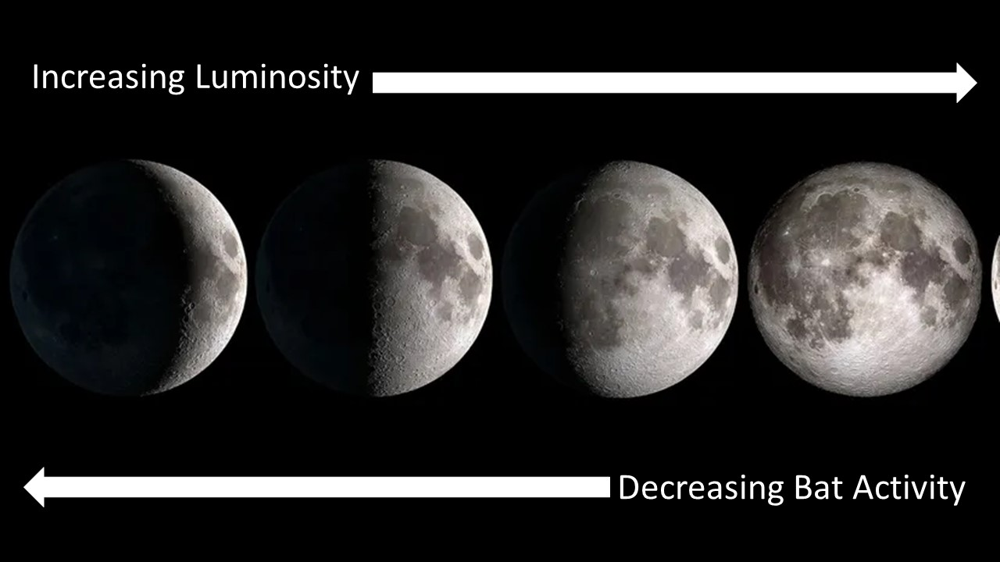
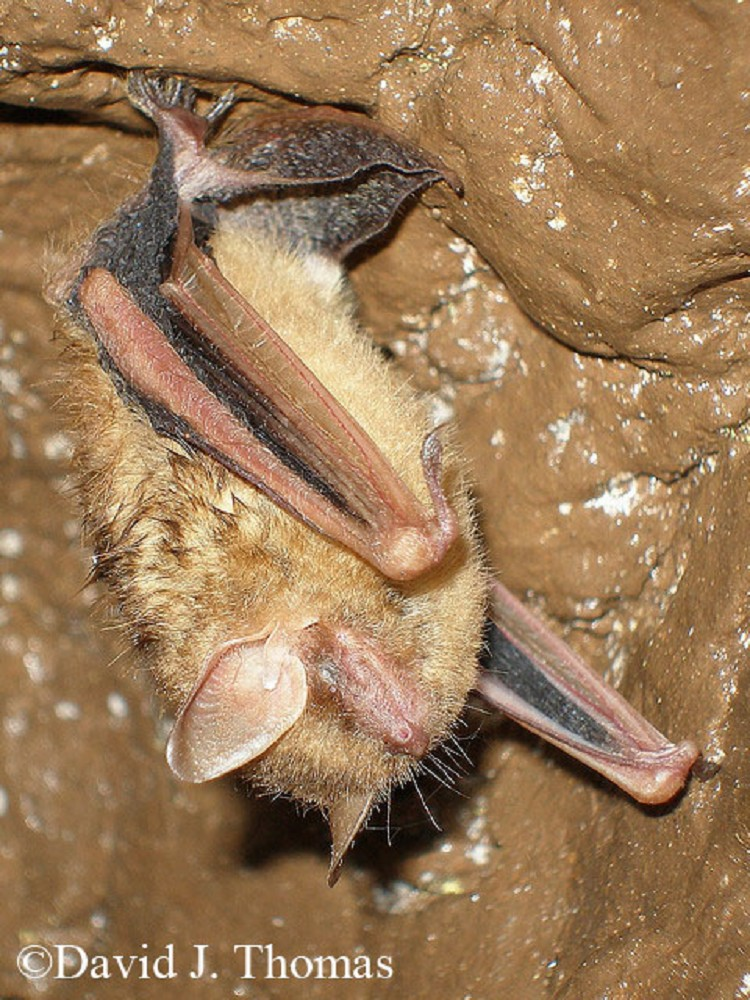

```{r setup, echo=FALSE, include=FALSE}

library(tidyverse)
library(ggplot2)
library(dplyr)
library(tidyr)
library(knitr)      
library(leaflet)
library(hexbin)
library(readxl)
library(viridis)
library(knitr)
library(reshape2)

```

```{r data import, echo=FALSE, include=FALSE}

bat_lum <- read.csv("bat_lum_data.csv")

```

```{r binary model, echo=FALSE, include=TRUE}

batmodel <- glm(cbind(detections, change) ~ lum, data= bat_lum, family= binomial)

```

**Many studies have been done on the subject of lunar phobia regarding chiroptera species. Contrary to popular belief bat activity wanes as luminosity increases from the moon. It is believed that this is a mechanism bats use to avoid predation.**



**Exceptions to this rule do exist. For example, *Perimyotis subflavus*, commonly called the tricolored bat, is a weak flying, insectivorous bat that favors hunting under the closed canopy. Since the canopy can effectively block most light reflected by the moon, moon luminosity tends not to affect their foraging habits.**



``` {r table, echo=FALSE, include=TRUE}

kable(bat_lum[1:9, ], caption = 'Table 1. Bats detected using ANABAT Express acoustic detectors in response to increasing moon luminosity.')

```

```{r model plot, echo=FALSE, include=TRUE}

ggplot(bat_lum, aes(x=detections, y=baseline_ratio)) +
  geom_point() +
  geom_smooth(method="glm", method.args=list(family="binomial"(link="logit")), se=FALSE)+
  geom_hline(yintercept = mean(bat_lum$baseline_ratio), linetype = "dashed") +
  labs(x="Individual Detections", y="Ratio from Baseline", title="Bat Detections Based on Moon Luminosity (%)")

```

```{r stat, echo=FALSE, include=TRUE}

coef(batmodel)

confint(batmodel)

summary(batmodel)

```
